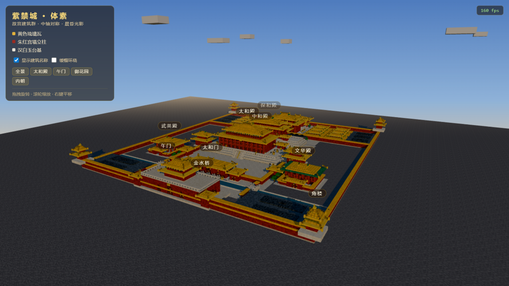
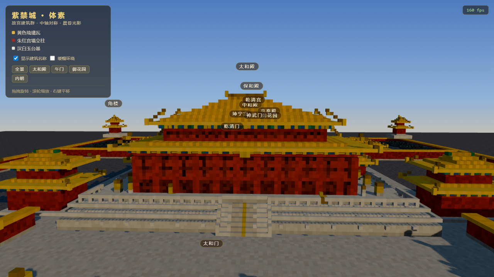
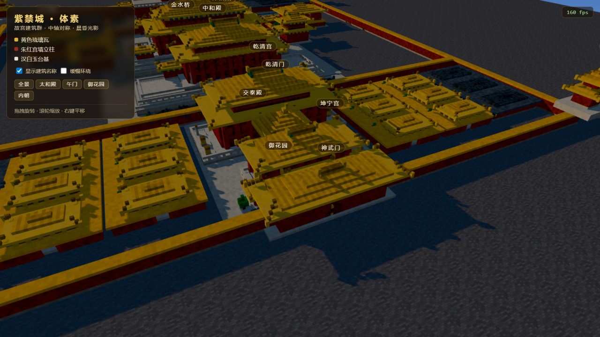

# 故宫 · 体素紫禁城（Three.js 体素建筑群）

用 Three.js 以 Minecraft 式体素方块拼砌的故宫建筑群场景，覆盖**前朝 + 内朝**的完整中轴序列。
打开页面即自动进入全景视角，缓慢环绕展示晨昏光影下的红墙黄瓦；面板可一键飞行至各殿。







## 运行方式

```bash
npm install        # 安装依赖（three + vite）
npm run dev        # 开发模式，浏览器打开 http://localhost:5173
npm run build      # 构建产物到 dist/
npm run build:single   # 构建 + 生成离线单文件
npm run check      # Node 冒烟测试（无需浏览器）
```

**免安装直接观看**：双击打开 `dist-single/故宫体素_单文件.html`（0.50 MB，
Three.js 已内联，断网可用，无需任何服务器）。

## 场景内容（约 28.6 万体素）

以南北中轴（+Z 指南）严格对称布局，完整动线：
**午门 → 内金水桥（5 座）→ 太和门 → 太和殿广场 → 三大殿 → 乾清门 → 后三宫 → 御花园 → 神武门**。

### 前朝
| 建筑 | 屋顶形制 | 说明 |
|------|----------|------|
| 午门 | 重檐庑殿（城楼） | 凹字形城台，三门洞拱券，双翼阙楼，甬道宫灯，斗匾 |
| 太和门 | 单檐庑殿 | 两侧贞度门 / 昭德门，廊庑围合，门前石狮铜缸 |
| **太和殿** | **重檐庑殿顶** | 面阔十一间，立于三层汉白玉须弥座；月台铜龟铜鹤、斗匾 |
| 中和殿 | 单檐四角攒尖顶 | 鎏金宝顶，居工字台基中颈 |
| 保和殿 | 重檐歇山顶 | 面阔九间，绿色山花 + 金色博脊端 |
| 体仁阁 / 弘义阁 | 二层歇山 | 广场东西楼阁 |
| 协和门 / 熙和门 | 单檐庑殿 | 广场围墙上门座；东西朝房连廊（灰瓦） |
| 中左门 / 中右门 / 后左门 / 后右门 | 单檐庑殿 | 台基四隅门座 |
| 文华殿 | 单檐歇山（绿剪边） | 东路配殿；武英殿（黄瓦）西侧对称 |

### 内朝
| 建筑 | 屋顶形制 | 说明 |
|------|----------|------|
| 乾清门 | 单檐庑殿 | 前朝 / 后寝分界墙上门座，两侧军机处 / 九卿房灰瓦矮房 |
| 乾清宫 | **重檐歇山顶** | 内朝正殿，面阔九间， own 汉白玉台基 + 日晷嘉量铜缸 |
| 交泰殿 | 单檐四角攒尖顶 | 鎏金宝顶 |
| 坤宁宫 | 单檐歇山顶 | 中轴后寝正殿 |
| 东西六宫 | 单檐庑殿 | 每侧 2 列 × 3 行共 12 座宫院（院墙、门豁、正殿、古柏），外墙筒子连房 |
| 御花园 | — | 钦安殿、天一门、堆秀山 + 御景亭、万春 / 千秋双亭、古柏 |
| 角楼 ×4 | 十字脊 + 鎏金宝顶 | 宫墙四隅 |
| 神武门 | 单檐庑殿 | 北门城楼 |

### 建筑工艺细节
三层台基螭首（排水兽首）、望柱寻杖栏杆、御路丹陛石（金线云龙）、四面踏跺、朱红柱网 +
格扇（上格心下裙板）、檐下真斗拱出挑（绿蓝彩画 + 金色坐斗）、瓦垄明暗相间、垂脊描深 +
金色脊兽、正脊鸱吻、檐角翘起、墙脚石裙、斗匾（蓝底金边）、石狮、鎏金铜缸、铜龟鹤、
日晷、嘉量、宫灯、十八槐古树、体素流云。

## 技术要点

- **单 InstancedMesh** 渲染全部约 **28.6 万体素**（逐实例颜色 + 坐标确定性明度抖动），
  整个建筑群仅 1 个 draw call；实测 **160 fps**（远高于 30 fps 要求）。
- 屋顶参数化生成器：`hipRoof`（庑殿，可挖重檐环洞）、`gableHipRoof`（歇山，垂直山花）、
  `pyramidRoof`（攒尖）、`crossRoof`（十字脊并集），按"露出的阶梯带"发射可见体素；
  内建筒瓦垄（列明暗交替）与垂脊 / 脊兽点缀。
- 体素世界 `Map` 覆盖式写入：先画大块、后叠细节自动盖过底色。
- 预设机位飞行（全景 / 太和殿 / 午门 / 御花园 / 内朝），easeInOut 相机补间；
  建筑名称标签按屏幕投影 + 距离淡出；体素云缓漂；开场 3 秒推近 + 可关闭的缓慢环绕。

## 项目结构

```
gugong-voxel/
├── index.html              # 页面骨架 + UI 面板（图例 / 开关 / 机位按钮）
├── src/
│   ├── main.js             # 渲染器 / 相机 / 光照 / 云 / 机位飞行 / 标签
│   ├── voxels.js           # 体素世界（Map 覆盖写入 → InstancedMesh）
│   ├── palette.js          # 故宫调色板 + 颜色扰动 + 数值明度工具
│   ├── roofs.js            # 庑殿 / 歇山 / 攒尖 / 十字脊（瓦垄、垂脊、鸱吻、翘角）
│   ├── structures.js       # 宫墙 / 栏杆 / 台阶 / 格扇 / 斗拱 / 门洞 / 树木 / 陈设
│   ├── layout.js           # 全部建筑布局（坐标规划在此）
│   └── textures.js         # 程序化青砖 / 汉白玉 / 天空渐变贴图
├── scripts/
│   ├── smoke.mjs           # Node 冒烟测试（体素总量 / 边界 / 21 项关键构件抽查）
│   └── make-singlefile.mjs # 内联 JS/CSS 生成离线单文件
├── preview/                # 实测截图
└── dist-single/故宫体素_单文件.html   # 免安装离线版
```

## 实测结果

- `npm run check`：**21 项断言全部通过**（体素 286,287、边界合规、三大殿 / 后三宫 / 六宫 /
  御花园 / 角楼 / 桥梁等关键构件在位、门洞贯通）。
- 浏览器实测（Chromium，1280×720）：稳定 **160 fps**，全景 / 特写 / 机位飞行均无掉帧。
- 离线单文件 0.50 MB，双击即看。
